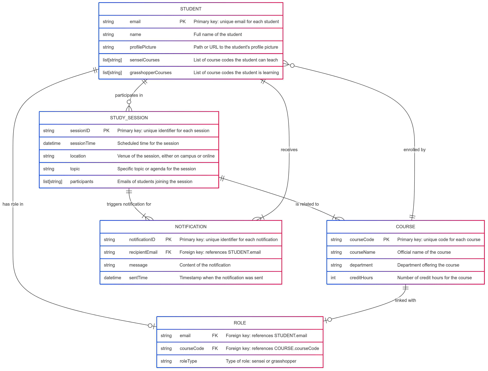
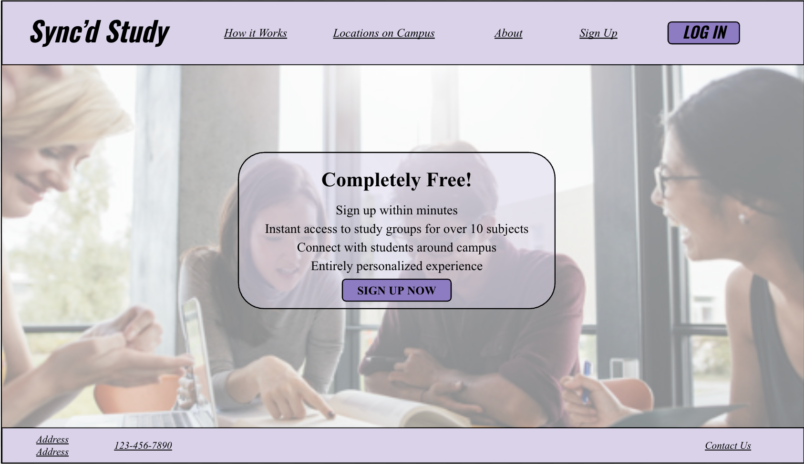
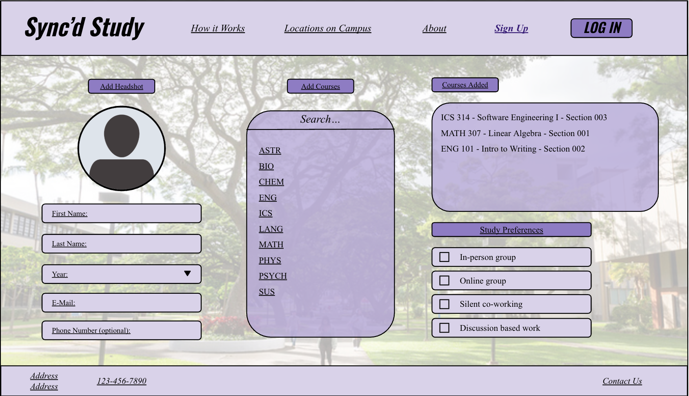
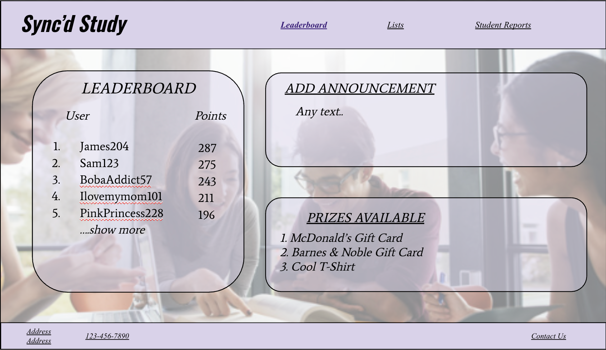
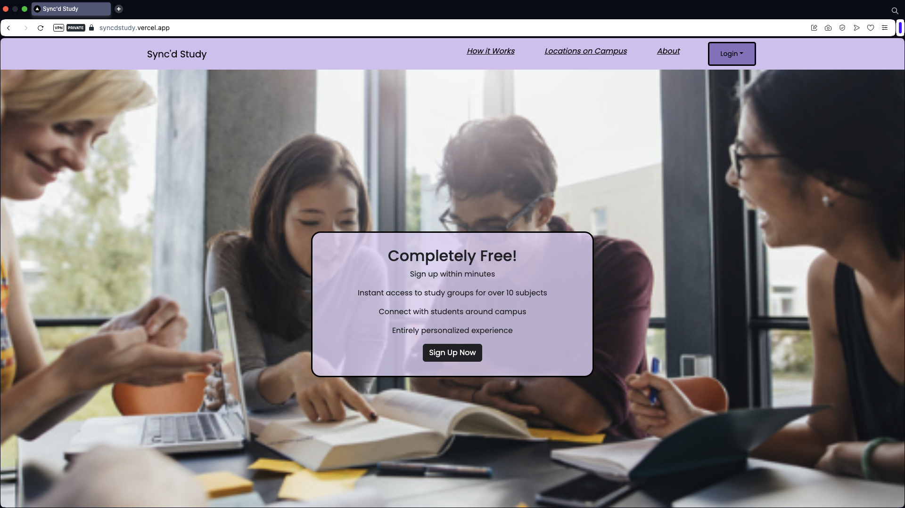
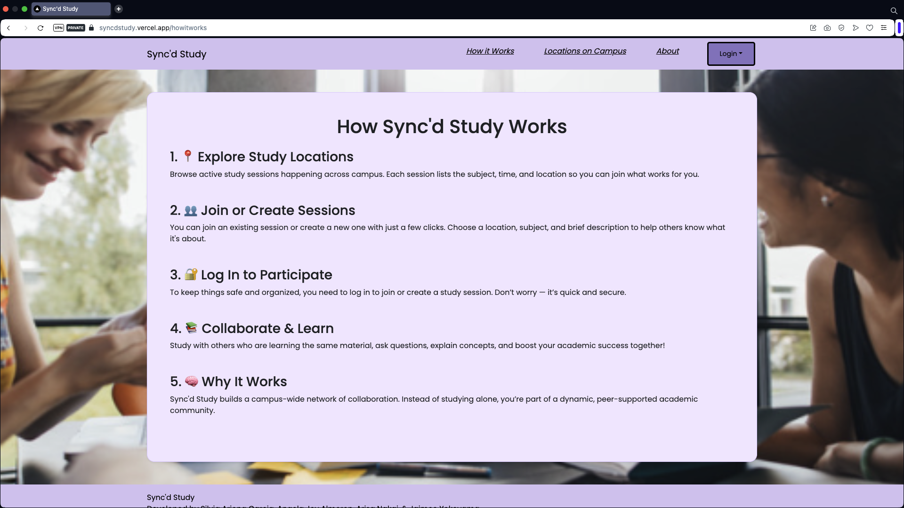
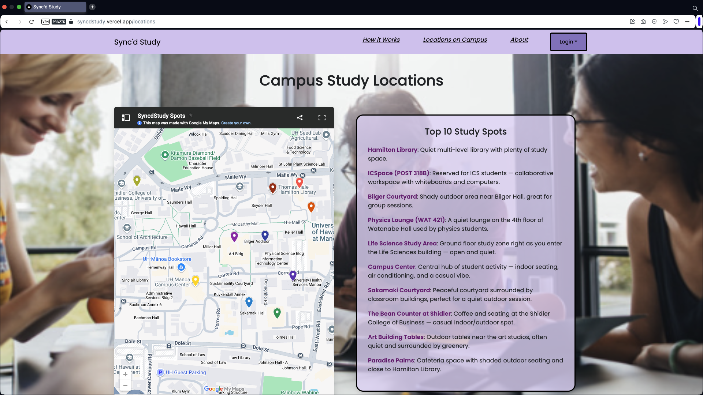

# Sync'd Study

## Table of Contents
* [Overview](#overview)
* [Deployment](#deployment)
* [ERD](#entity-relationship-diagram-erd)
* [User Guide](#user-guide)
* [Community Feedback](#community-feedback)
* [Developer Guide](#developer-guide)
* [Development History](#development-history)
* [Meet the Team](#meet-the-team)

## Overview
*The Problem:* UHM students often spend more time than they need on their homework and don't learn the material as effectively as they could, because they study alone and do not leverage the power of face-to-face study groups with peer mentors.

*The Solution:* Sync'd Study is a web application designed to help students at the University of Hawai'i at Manoā optimize their study time through peer-organized, in-person study sessions. It enables students to easily propose and join study sessions in many different subjects. Students are categorized as “<ins>sensei</ins>” (helpers) and “<ins>grasshoppers</ins>” (learners) depending on the course.

### Key Features

Here's how it works: 

- **User Profiles:** Students must log in and set up their profile that includes a headshot and two course lists:
    - Courses they've taken and can help with. (Sensei)
    - Courses they're currently taking and need help with. (Grasshopper)
    - Every student can be both a sensei and a grasshopper, depending on the course.

- **Course Directory:** All courses are listed on the site. Within each course, students can view the senseis and grasshoppers associated with it. 

- **Study Session Scheduling:** Grasshoppers can propose face-to-face study sessions focused on a specific topic (e.g. “Write my essay on configuration management” and a time to meet in Campus Center (i.e. 10:30-11:30 AM morning)).
    - *Plan Ahead:* Schedule a study session in advance for later in the day or week.
    - *Right Now:* Create a session instantly, notifying others that help is needed now in Campus Center.

- **Notifications:** When a session is proposed, senseis and grasshoppers for that course will receive a notification.

- **Calendar View:** A shared calendar displays all upcoming and ongoing study sessions, along with the list of attendees.

- **Gamification:** To encourage participation, the app includes:
    - A point system, levels, and a leaderboard.
    - Incentives such as gift cards for top-performing senseis and grasshoppers.
    - Anti-cheating measures to ensure points are earned through meaningful interaction. *(Feature under discussion)*

### Goals

- Foster in-person collaboration on campus.
- Encourage student interaction and peer mentoring.
- Promote safe, structured real-world study support.

## Deployment

Sync'd Study is made accessible to everyone through a [Vercel](https://vercel.com) deployment. Once a new code or update is pushed to the repository, Vercel automatically handles the building process and rolling out the latest version, minimizing downtime. This approach means that improvements, new features, or bug fixes are quickly made available to everyone using Sync'd Study.

Click [here](https://syncdstudy.vercel.app) to visit the live application!

## Entity-Relationship Diagram (ERD)

This is an AI-generated Entity-Relationship Diagram that illustrates the core database structure of Sync’d Study, showing how students, courses, roles, study sessions, and notifications are interconnected. It enables features like personalized session matching, role-based course support (sensei or grasshopper), and real-time collaboration through scheduled study sessions and notifications.

## User Guide

This section provides a walkthrough of the Sync'd Study user interface and its capabilities.

### Landing Page

The public entry point that welcomes the student to the web application. The top navigation bar in this page guides the student to key sections such as *How It Works*, *Location on Campus*, *About*, *Sign-up*, and *Log-in*, making it quick and easy to learn about the platform or get started right away!

- The *How It Works* section explains the overall process of using the web application (e.g., how to create a session, join sessions, etc.).
- The *Location on Campus* section displays specific places on campus that students can meet up in person. 
- The *About* section provides the background information on Sync'd Study, team, and its mission.

**Mock-up Landing Page**

### User Profile Setup 

To sign-up, users are first prompted to enter their email and preferred password. Next, they'll be directed to set up their profile, where they can provide basic information (e.g., name, year, etc.), add courses, and specify study preferences. After adding a course, they'll also be asked whether they want to be a *sensei*, *grasshopper*, or both.

**Mock-up User Profile Setup Page**

### User Page

After logging in, users are directed to the *Calendar* page, which displays a monthly overview of their study sessions and other features such as a list of their courses that consist of sessions, upcoming sessions (weekly), to-do list, a button to create a session. The top navigation bar in this page guides the user to key sections--Upcoming Sessions, My Courses, My Profile, and Gamification (feature under discussion)--so they can easily manage their schedule and profile details: 

- The *My Courses* section allow users to add or remove courses. For adding a course, they'll be asked whether they want to be a *sensei*, *grasshopper*, or both.
- The *My Profile* section allow users to store and upate their personal information and preferences (e.g. year, social links).
- The *Gamification* section may include a leaderboard (public to all users), the user's stats section displaying their points and current level, and a monthly prize to reward active participation.
- Within the *Calendar* page, users can create a new session by entering details (e.g., subject name (what they need help on), course, time, date, preferred location (in-person or online), scheduling option ("plan ahead" or "right now!")). If a session already exists, users can click on the existing session and can edit it by updating time, location, or other meeting details.

**Mock-up User Page**

### Notifications

With the Notification toggle enabled, members of the course will receive alerts whenever someone creates a new study session. Each alert prompts them to either ignore the notification or respond if they're interested in joining.

## Community Feedback

Have suggestions or comments? Submit your feedback through our Sync'd Study Feedback Form.

## Developer Guide

### Admin Tools
Admins can monitor user activity, resolve issues, and ensure the space remains safe and supportive. Users can also contact admins to report inappropriate behavior.

Admins can:
- Review user reports
- Moderate sessions
- Manage reward programs

**Mock-up Admin Page**

## Development History

Development follows an issue-driven project management process. Tasks are managed using GitHub Projects, with branches per issue and milestones.

[Milestone 1](https://github.com/orgs/syncdstudy/projects/1):

- Initial project setup & planning completed (e.g., GitHub repository creation, mock-up sketches, deploy to Vercel).
- Created the following mock-up pages:
    - Landing page
    - User Profile Set-up page
    - User page
    - Admin page
- Create the following pages:
    - Landing page
    - "How it Works" page

[Milestone 2](https://github.com/orgs/syncdstudy/projects/2): 

- No development tasks completed for this milestone yet.

Milestone 3: 

- No development tasks completed for this milestone yet.

Milestone 4: 

- No development tasks completed for this milestone yet.

**Progress:**

## Meet the Team

Sync'd Study is developed by a team of ICS students at UH Mānoa: [Angela Joy Almeron](https://angelaalmeron.github.io/), [Silvia Arjona](https://silviaarjonag.github.io/), [Arisa Nakai](https://arisa-1208.github.io/), and [Jaimee Yokoyama](https://jamiee-tech.github.io/). For more information or contributions, visit our [GitHub repo](https://github.com/syncdstudy/syncdstudy.github.io).

Our [Team Contract](https://docs.google.com/document/d/1zECIUP7hNx_SDHHqtqRzjvWOJxT7PPx1KGY5Zllg55c/edit?usp=sharing).
