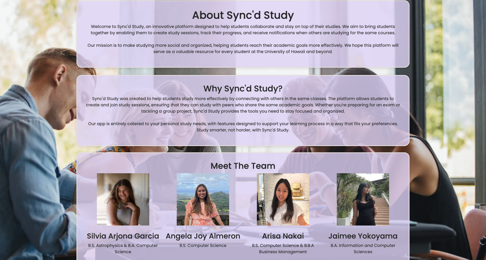
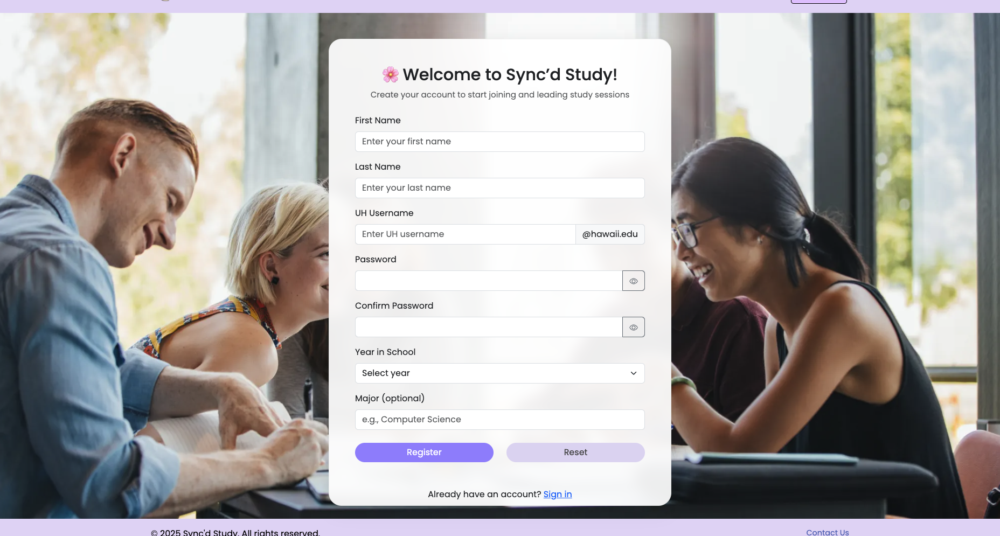
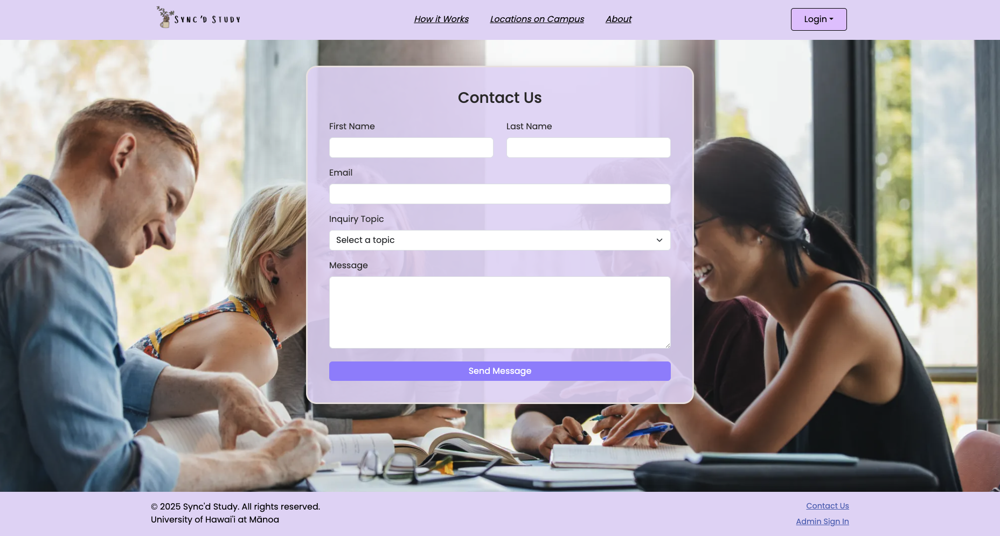

# Sync'd Study

## Sync'd Study GitHub Links
* [GitHub Organization](https://github.com/syncdstudy)
* [Project Home Page Repository](https://github.com/syncdstudy/syncdstudy.github.io)
* [Application Project Repository](https://github.com/syncdstudy/syncdstudy)

## Table of Contents
* [Overview](#overview)
* [Meet the Team](#meet-the-team)
* [Deployment](#deployment)
* [ERD](#entity-relationship-diagram-erd)
* [User Guide](#user-guide)
* [Community Feedback](#community-feedback)
* [Developer Guide](#developer-guide)
* [Development History](#development-history)

## Overview
*The Problem:* UH Manoā students often spend more time than they need on their assignments and don't learn the material as effectively as they could. This is because they study alone, without the support of peers. 

than they need on their homework and don't learn the material as effectively as they could, because they study alone and do not leverage the power of face-to-face study groups with peer mentors.

*The Solution:* Sync'd Study is a web application designed to help UH Manoā students to collaborate, connect, and optimize their study time through peer-organized study sessions. It enables students to easily propose and join study sessions in many different subjects at UH Manoā. By connecting students through both in-person and online study groups, this web application aim to foster a more collaborative and effective learning experience. 

### Key Features

Here's how it works: 

- **User Profiles:** Students can sign up to create a profile with basic information, including their name, major, minor (if applicable), and interests. Once logged in, they'll be directed to their personalized dashboard, which provides a convenient overview of all their study sessions.

- **Study Session Scheduling:** Students can propose face-to-face or online study sessions focused on specific topics (e.g., for ICS 314, "Help on writing my essay on configuration management") and set a time and location (e.g., 10:30-11:30 AM at Campus Center).

- **Notifications:** Students will receive a notification whenever a new session is proposed, allowing them to choose whether to join or ignore the invitation.

### Goals

- Build a supportive academic community, both online and in-person.
- Encourage student interaction and peer mentoring.
- Promote safe, structured real-world study support.

## Meet the Team

Sync'd Study is developed by a team of ICS students at UH Mānoa: [Angela Joy Almeron](https://angelaalmeron.github.io/), [Silvia Arjona](https://silviaarjonag.github.io/), [Arisa Nakai](https://arisa-1208.github.io/), and [Jaimee Yokoyama](https://jamiee-tech.github.io/). For more information or contributions, visit our [GitHub repo](https://github.com/syncdstudy/syncdstudy.github.io).

Our [Team Contract](https://docs.google.com/document/d/1zECIUP7hNx_SDHHqtqRzjvWOJxT7PPx1KGY5Zllg55c/edit?usp=sharing).

## Deployment

Sync'd Study is made accessible to everyone through a [Vercel](https://vercel.com) deployment. Once a new code or update is pushed to the repository, Vercel automatically handles the building process and rolling out the latest version, minimizing downtime. This approach means that improvements, new features, or bug fixes are quickly made available to everyone using Sync'd Study.

Click [here](https://syncdstudy.vercel.app) to visit the live application!

## Entity-Relationship Diagram (ERD)

This is an AI-generated Entity-Relationship Diagram that illustrates the core database structure of Sync’d Study, showing how students, courses, roles, study sessions, and notifications are interconnected. It enables features like personalized session matching, role-based course support (sensei or grasshopper), and real-time collaboration through scheduled study sessions and notifications.


## User Guide

This section provides a walkthrough of the Sync'd Study user interface and its capabilities.

### Landing Page

The public entry point that welcomes the student to the web application. The top navigation bar in this page guides the student to key sections such as *How It Works*, *Location on Campus*, *About*, and *Log-in*, making it quick and easy to learn about the platform or get started right away!

- The *How It Works* section explains the overall process of using the web application (e.g., how to create a session, join sessions, etc.).
- The *Location on Campus* section displays popular study spots on campus that students can choose to meet up in person. 
- The *About* section provides the background information on Sync'd Study, its mission, and the team that made the dreamwork.






### User Page

After logging in, students are directed straight to the *Dashboard* page, which displays an overview of their study sessions and other features such as upcoming sessions and to-do lists. The top navigation bar in this page guides the user to key sectionsDashboard, Study Sessions, Leaderboard, Study Spots, and My Profile—so they can easily manage their schedule and profile details: 

- The *Study Session* page allows students to create new sessions by providing key details, including the subject, course, time, date, preferred format (in-person or online), location (if in-person), and a brief description. Students will receive notifications when sessions are created for courses they are enrolled in. Additionally, all their scheduled sessions can be easily viewed in the "My Sessions" section.
- The *Study Spots* page is similar to the *Location on Campus* section from the landing page, providing students with a convenient way to find on-campus locations for in-person study sessions.
- The *My Profile* page allows students to store and update their personal information, such as their name and year.


### Admin Page
Admins can monitor user activity, resolve issues, and ensure the space remains safe and supportive. students can also contact admins to report inappropriate behavior, ask for additional help/support, and provide feedback about the web application. Lastly, admins can sign in using their email, password, and a dedicated admin passcode.

Admins can:
- Moderate sessions
- Review user reports




## Community Feedback

Have suggestions or comments? Submit your feedback through our [Sync'd Study Feedback Form](https://syncdstudy.vercel.app/contact).

## Developer Guide

This section serves as a developer guide for downloading, installing, running, and customizing the Sync'd Study application for personal use or further development.

### Getting Started

Before diving into the code, make sure you have the following prerequisites installed (latest versions): 
* Node.js
* npm 

#### Clone the Repository

To get started, visit the [Sync'd Study project repository](https://github.com/syncdstudy/syncdstudy). You have two options to set up the project locally:
* **Use this template:** If you want to start a new project based on Sync'd Study, click the "Use this template" button. Complete the repository details, then open the project in GitHub Desktop or your preferred Git client.
* **Clone the Repository:** If you want to work directly with the existing repository, click the "Code" button, select "Open with GitHub Desktop" to clone it to your local computer, or copy the repository URL to clone it using the command line:
```
git clone https://github.com/syncdstudy/syncdstudy.git
cd syncdstudy
```

#### Environment Setup

Copy the provided .env.example file to .env and fill in the required environment variables:
```
cp .env.example .env
```
Ensure you have the correct environment variables for Prisma and Supabase configured.

### Installation
Next, install the required dependencies:
```
npm install
```
This command will install all the necessary packages, including Prisma, Next.js, and React components.

### Running the Application
To start the application locally:
```
npm run dev
```
The application will be accessible at [localhost: 3000](http://localhost:3000)

### Database Setup (Supabase)
Sync'd Study uses [Supabase](https://supabase.com) as its backend database, which is PostgreSQL-compatible with real-time updates and authentication.

#### Create a Supabase Project
1. Create a free account on Supabase.
2. Create a new project and note the Project URL and anon key for your environment variables.

#### Configure Environment Variables
Add the following to your .env file:
* NEXT_PUBLIC_SUPABASE_URL
* NEXT_PUBLIC_SUPABASE_ANON_KEY
* SUPABASE_SERVICE_ROLE_KEY
* DATABASE_URL

#### Run Database Migrations
Run the Prisma migrations to set up the database schema:
```
npx prisma migrate dev --name init
```
To seed the database with initial data, use:
```
npx prisma db seed
```

### Test the Application
To test if the application is working: 
1. Run the application.
2. Navigate through the application and verify the features are working properly.

## Development History

Development follows an issue-driven project management process. Tasks are managed using GitHub Projects, with branches per issue and milestones.

[Milestone 1](https://github.com/orgs/syncdstudy/projects/1):

- Initial project setup & planning completed (e.g., GitHub repository creation, mock-up sketches, deploy to Vercel).
- Created the following mock-up pages:
    - Landing page
    - User Profile Set-up page
    - User page
    - Admin page
- Create the following pages:
    - Landing page
    - "How it Works" page

[Milestone 2](https://github.com/orgs/syncdstudy/projects/2): 

- Created the following pages:
    - "Locations on Campus" page
    - "About" page
    - Sign-in, Sign-up, Sign-out, & Change Password pages
    - User Home page: Calendar, My Profile, My Courses, & Create a Study Session
    - Admin Home page

[Milestone 3](https://github.com/orgs/syncdstudy/projects/4): 

- Created the following pages:
    - "Study Session" page
    - "Contact Us" page
    - "Leaderboard" page
- Improved the functionality & quality of the landing, user, and admin pages.

### Continuous Integration
The current results of continuous integration via badge:
